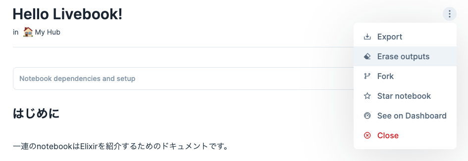

※このディレクトリは https://github.com/access-company/IoTIntern/tree/master/doc/elixir-training を基にLivebookで書き換えたものである。

# Elixir training

Elixirの基本的な文法の学習のためのドキュメント集である。

Elixirのコードを試すだけなら`iex`が最も手軽だが、複数行にわたるコードを書いたり、コードの一部を変更して試行錯誤的に実験する際には不便である。
これらの問題が解消されることと、コードとその実行結果がセットで記録に残ることの有用さによりJupyter notebookを使用している。

## セットアップ

Elixirの実行環境であるLivebookが必要である。
- ここでは準備を簡易化するためDockerを使用する
  - ErlangとElixirのバージョンは[Livebookのdocker image](https://github.com/livebook-dev/livebook/pkgs/container/livebook)で指定されたものになる

### ローカルで使用するツールのインストール

`docker`コマンドが使えればいい。
- [Dockerのインストール](https://docs.docker.jp/get-docker.html)

### コンテナの起動
- 前提
  - このファイルと同じディレクトリに居ること
- `make`コマンドが使える場合
  - `make run`
- それ以外
  - `docker run -p 8888:8888 -p 8889:8889 --pull always -u $(UID):$(GID) -v $(PWD)/notebooks:/data -e LIVEBOOK_PORT="8888" -e LIVEBOOK_IFRAME_PORT="8889" ghcr.io/livebook-dev/livebook:0.9.2`

### Livebookへのアクセス

- Webブラウザで[http://localhost:8888](http://localhost:8888)を開く
- 認証画面に遷移するので、起動時のログに表示されたtokenを入力
  - `[Livebook] Application running at http://0.0.0.0:8888/?token=[token]`の[token]部分
  - URLをそのままクリックしても起動できる
- 右上にあるopenボタンを押下するとノートブックが置いてある場所にアクセスできる
  - ファイルの実体はローカルの[`notebooks`](./notebooks)ディレクトリに存在する

## Contributing guide

- Notebookの変更をコミットする前に、下の画像のように右上にある縦三点リーダーから`Erace Outputs`を実行した上で保存しておくこと
  - 演習のために、コードの実行結果を消しておくため
  - 本質的でないメタデータの差分が混じることを防ぐため
    
