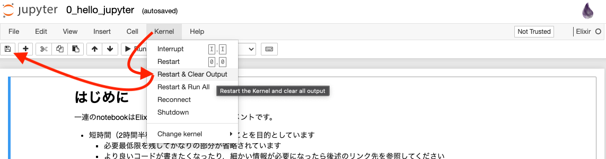

# Elixir training

Elixirの基本的な文法の学習のためのドキュメント集である。

Elixirのコードを試すだけなら`iex`が最も手軽だが、複数行にわたるコードを書いたり、コードの一部を変更して試行錯誤的に実験する際には不便である。
これらの問題が解消されることと、コードとその実行結果がセットで記録に残ることの有用さによりJupyter notebookを使用している。

Jupyter notebook上でElixirコードを実行するため、[IElixir](https://github.com/pprzetacznik/IElixir)を使用している。
なお、notebookの実行環境として、後発で高機能なJupyter labも選択可能であるが、現時点ではElixirコードのシンタックスハイライトやコード補完が効かず不便なため使用していない。

## Notebookの実行方法

Jupyter notebookと、Elixirの実行環境が必要である。
手軽なのはDockerを使用する方法であり、Dockerが使用可能かつ、最新でない特定のバージョンのElixirを使う必要がなければ下記の方法を推奨する。

### 事前準備

次のどちらかのセットアップを行う。`docker compose`コマンドが使用できればいい。
1. [Docker Desktop](https://www.docker.com/products/docker-desktop)
2. [Docker](https://www.docker.com/) & [docker compose cli](https://github.com/docker/compose-cli)

### コンテナの起動

```sh
$ cd docker
$ docker compose up
```

### Notebookへのアクセス

- Webブラウザで[http://localhost:8888](http://localhost:8888)を開く
  - `notebooks`ディレクトリを開く
- ファイルの実体は[`notebooks`](./notebooks)ディレクトリに存在する

### 補足: 自前で実行環境をセットアップする場合の注意点

- 特定のバージョンのElixirを使用する場合、適合するバージョンのIElixirを使用すること
  - [IElixir/mix.exs](https://github.com/pprzetacznik/IElixir/blob/master/mix.exs)のElixirバージョン指定を見て、適当なコミット時点のものを利用する

## Contributing guide

- Notebookの変更をコミットする前に、下の画像のようにnotebookのツールバーの`Kernel` > `Restart & Clear Output`を実行した上で保存しておくこと
  - 演習のために、コードの実行結果を消しておくため
  - 本質的でないメタデータの差分が混じることを防ぐため
  
