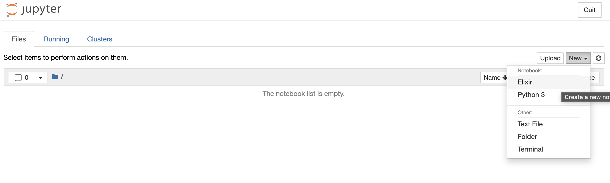

# Gear開発用EC2インスタンスの起動

- ベースとなるAMIのidと必要なインスタンス数を指定し、[このスクリプト](../../../script/aws/launch_instances.sh)で起動する
  ```sh
  script/aws/launch_instances.sh ami-xxx 16
  ```
  - Nameが`iot-intern`であるインスタンスが起動する
- 稼働中(インスタンスの状態が`running`)の`iot-intern`インスタンスのパブリックIPアドレス一覧は[このスクリプト](../../../script/aws/list_public_ip_addresses.sh)で取得できる
  ```sh
  script/aws/list_public_ip_addresses.sh
  ```

## インターンのための動作確認

- [スクリプト](../../../script/aws/launch_instances.sh)を用い、1台インスタンスを起動
  ```sh
  script/aws/launch_instances.sh ami_xxx 1
  ```
- 起動したインスタンスに`intern-user`でSSH接続できること
  - 後の確認のためポートフォワーディングも行っておく
    ```sh
    ssh intern-user@<public_ip_address> -i ~/.ssh/iot-intern-user-key -L 8080:localhost:8080 -L 8081:localhost:8081
    ```
- Jupyter notebook上でIElixirが動作すること
  - ポートフォワーディングした状態で、ローカルのWebブラウザで http://localhost:8081 にアクセス
  - 図のように、カーネルとしてElixirを指定して新しいnotebookを開く
    
  - 適当なElixirコードを入力してセルを実行し、実行結果が出力されることを確認
- IoTIntern gearが起動し、ローカルからアクセスできること
  - リモートでgearを起動
    ```
    cd IoTIntern
    mix deps.get && mix deps.get
    iex -S mix
    ```
  - ポートフォワーディングした状態で、ローカルのWebブラウザから http://iot-intern.localhost:8080/ui/index.html にアクセス
  - お掃除ロボットシミュレーターのページが表示されることを確認
  - お掃除ロボットがクラッシュした時、リモートのgearにアクセスログが表示されることを確認
- [このドキュメント](./setup_ssh_config_for_admin.md)に従い、管理者ユーザーでSSH接続できること
