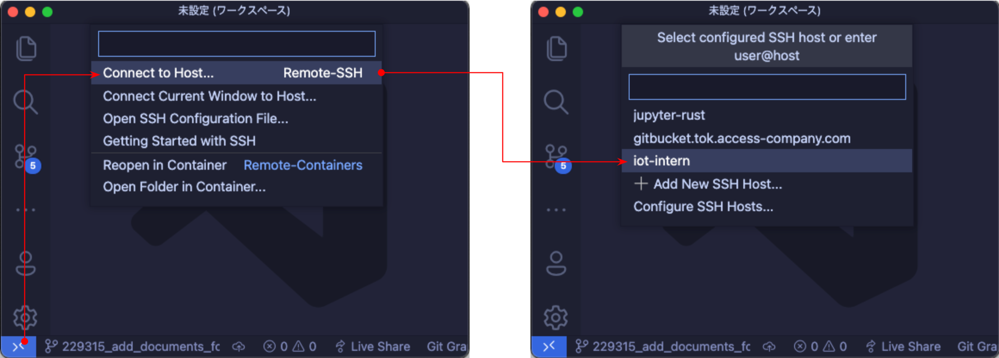
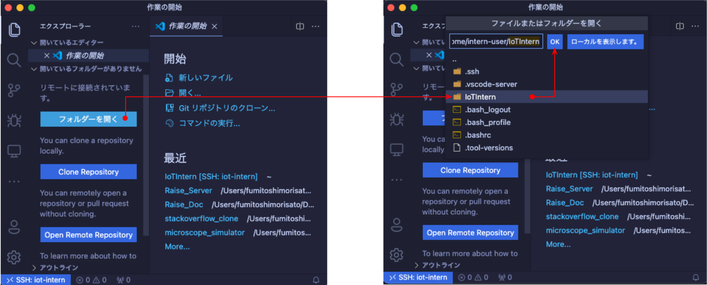

# SSH接続セットアップ

Gear開発はEC2インスタンス上で行う。そのため、EC2インスタンスへのSSH接続と、リモートのファイル編集をできるよう準備する必要がある。
ここではSSH接続と、VSCode(のRemote - SSH拡張機能)を用いてEC2インスタンス上のファイル編集を行うためのセットアップ手順を説明する。

## 事前確認

- SSH接続のための秘密鍵(`iot-intern-user-key`)が手元にあること
- SSH接続先のEC2インスタンスのパブリックIPアドレスが手元にあること

## sshコマンドの確認

最近のOSでは標準でOpenSSHがインストールされていることが多い。
既に`ssh`コマンドを利用可能かどうか確かめ、必要であればOpenSSHのインストールを行う。

- [ターミナルアプリ](#補足)で`ssh`コマンドのバージョンを表示する。
  使われているライブラリやバージョンが異なるかもしれないが、下記のような出力が得られればOK。

  ```sh
  $ ssh -V
  OpenSSH_8.1p1, LibreSSL 2.7.3
  ```

- `コマンドが見つかりません`、`command not found`のようなメッセージが出力される場合は[SSH clientのインストール](#ssh-clientのインストール)が必要。


### SSH clientのインストール

ここではOpenSSHをインストールすることにする。

#### Mac

[Homebrew](https://brew.sh/index_ja)経由でのインストールが楽。
- 公式の手順に従ってHomebrewをインストール
- ターミナルでで`brew install ssh`を実行

#### Windows

[Microsoftが示している手順](https://docs.microsoft.com/ja-jp/windows-server/administration/openssh/openssh_install_firstuse)でインストールする


### 補足

ターミナルとして、VSCode統合ターミナルを使用可能である。

- 次のキー組み合わせでVSCodeの統合ターミナルを開く
  - Mac: `Ctrl` + `Shift` + `@`
  - Windows: `Ctrl` + `@`

## EC2インスタンスへのSSH接続

### SSH秘密鍵の配置

ホームディレクトリ直下の`.ssh/`ディレクトリの中に`iot-intern-user-key`を移動してください。

#### Mac

- ターミナルで`cp ${path_to}/iot-intern-user-key ~/.ssh/` を実行
  - `${path_to}`は取得した秘密鍵があるディレクトリのパスに置き換えること

#### Windows

- `iot-intern-user-key`を`C:\Users\${your_user_name}\.ssh\`にコピー
  - `${your_user_name}`は自分の環境に合わせて置き換える
  - `.ssh\`フォルダがなければ新規作成してください
  - Explorerの設定で隠しフォルダを表示するよう設定変更しないと、`.ssh\`フォルダは見えないかもしれない

### SSH接続の設定

`.ssh/config`ファイルに設定を追記します。
ターミナルからVSCodeを起動できることを前提とします。

#### Mac

- `code ~/.ssh/config`を実行してファイルを開きます

#### Windows

- `code C:\Users\${your_user_name}\.ssh\config`を実行してファイルを開きます

#### 追記内容(Mac・Windows共通)

- 下記の内容を追記
  `ip.add.of.ec2`はEC2インスタンスのパブリックIPアドレスに置き換える
  ```
  Host iot-intern
    HostName ip.add.of.ec2
    User intern-user
    IdentityFile ~/.ssh/iot-intern-user-key
  ```
- ファイルを保存

### SSH接続の確認

- ターミナルで`ssh iot-intern`を実行
  - 接続を続行するか聞かれるので、`yes`と入力し、Enterキーを押して続行
  ```
  PS C:\Users\fumitoshi> ssh iot-intern
  The authenticity of host 'ip.add.of.ec2 (ip.add.of.ec2)' can't be established.
  ECDSA key fingerprint is SHA256:TJWIKOwsF11Yd15NtClNV9uvtcmDvJEfIF4xMDZGPp0.
  Are you sure you want to continue connecting (yes/no/[fingerprint])?
  (type yes then press Enter key)
  ```
- 次のように表示されればOK
  ```
         __|  __|_  )
         _|  (     /   Amazon Linux 2 AMI
        ___|\___|___|

  https://aws.amazon.com/amazon-linux-2/
  [intern-user@ip-172-31-38-34 ~]$
  ```
- `exit`を実行し、SSH接続を終了

## VSCodeのRemote - SSHによる接続確認

VSCodeにRemote - SSH拡張機能がインストール済みであることを前提とする。

### Remote - SSHの使用

- VSCodeを開き、ウィンドウ隅の「><」のようなボタンを押す
  - 展開されるメニューから、「Connect to Host」を選んで押す
  - 接続先一覧に`.ssh/config`に追記した`iot-intern`が表示されるので。選択して押す
  
- VSCodeのウィンドウが新規に開く
  - ウィンドウ隅のボタンが「><」だったものが「>< SSH: iot-intern」になったことを確認
  - `Could not establish connection to "iot-intern": The operation timed out.`のようなエラーで接続に失敗する場合、[EC2インスタンスへのSSH接続](#EC2インスタンスへのSSH接続)を再度試す
- VSCodeでリモートにある`IoTIntern`ディレクトリを開く
  - VSCodeのサイドバーに表示されている「フォルダ-を開く」、またはメニューバーの「ファイル」> 「開く」を押す
  - ウィンドウ上部にリモートのカレントディレクトリが表示されるので、その中から`IoTIntern`ディレクトリを押す
  - その上部のOKを押す
  
  - `IoTIntern`ディレクトリ内のファイルなどを閲覧できることを確認する
    - この時点でリモートのファイルを編集することも可能

### SSH接続の終了

- VSCodeのウィンドウを閉じてSSH接続を終了する
